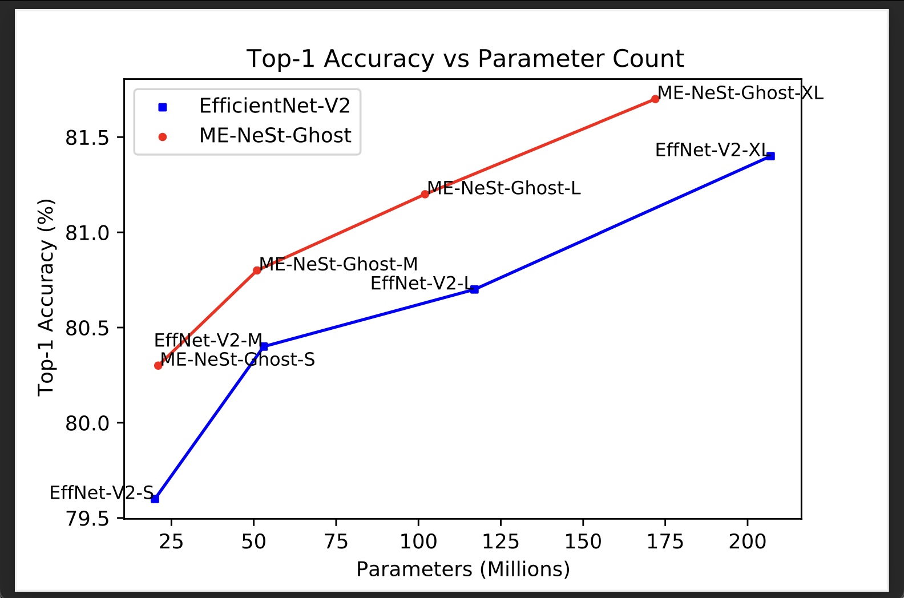

# UoE-Machine-Learning-Practical-INFR11132
This repository contains the code and reports for the course INFR11132 Machine Learning Practical. Overall Mark Achieved - 75%

Coursework 1 involves experiments conducted on the MNIST dataset with the help of the mlp library made for the course. These included - varying the width and the depth of the neural network and analysing the impact on its performance on the dataset, comparing and analysing the performance of the neural network with L1 penalty and L2 penalty, comparing and analysing the performance of the neural network with and without Dropout. This coursework also required the student to implement Dropout, L1 Penalty and L2 Penalty from scratch. Since the mlp library does not support CUDA all the model training was carried out on CPU.

Coursework 2 involves experiments conducted on the CIFAR-100 dataset by making use of Batch Normalization and Residual Connections in Convolutional Neural Networks. For this coursework, two famous model architectures - VGG-Net and ResNet were implemented and utilised for experiments. The coursework required the student to implement residual connections in Pytorch and analyse the performance of the VGG model architectures - with and without batch normalization, with and without residual connections, with both residual connections and batch normalizations. The importance of Residual Connections and Batch Normalizations was analysed in the context of the depth of the neural network and the performance of VGG08 without Batch Norm and Residual Connections was compared with that of VGG38 with and without Batch Norm and Residual Connections. Additional experiments were conducted with VGG16 with Batch Normalization and Residual Connection and VGG150 with Batch Normalization and Residual Connection with VGG16 performing the best on the CIFAR-100 dataset.

Coursework 3 features the final project for which I came up with the novel model architecture MixConv-EfficientNeSt-Ghost (ME-NeSt-Ghost). It was built to improve upon the EfficientNetV2 family of CNNs in image classification tasks with the help of a combination of mixed-depthwise convolutions, split attention modules and ghost convolutions. The ME-NeSt-Ghost was more parameter efficient than the EfficientNetV2 while providing comparable or even better results on the CIFAR-100 dataset

