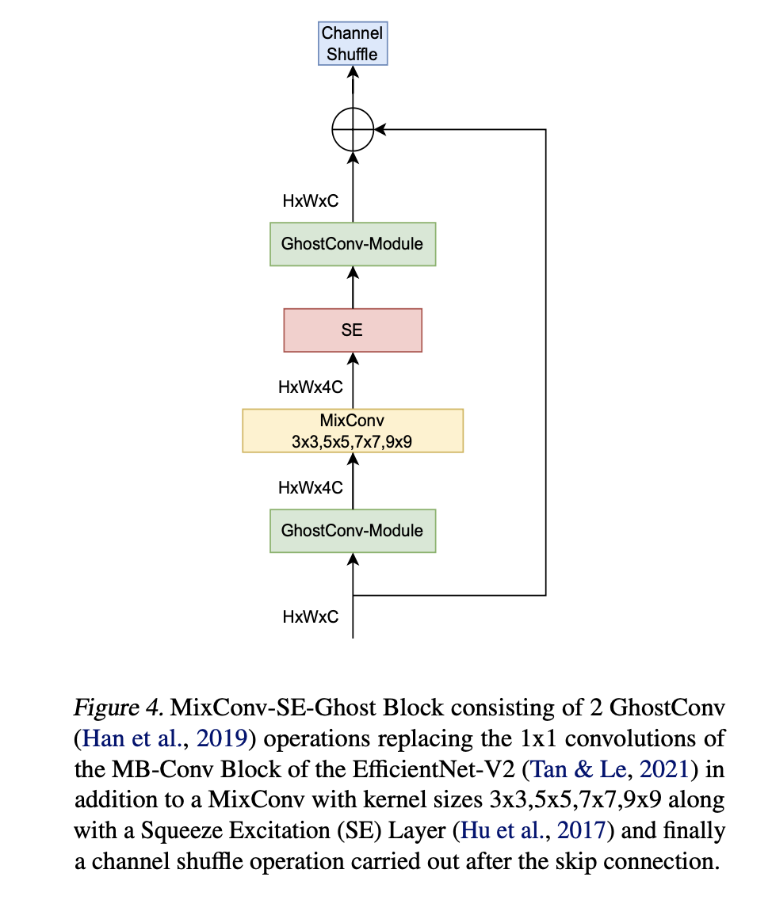
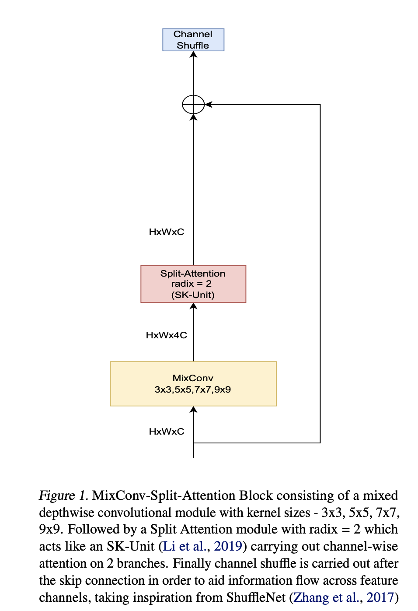
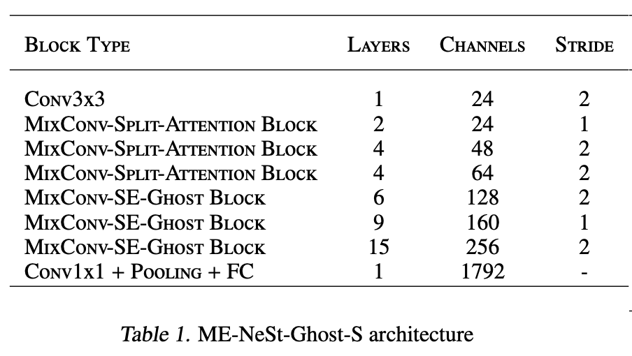
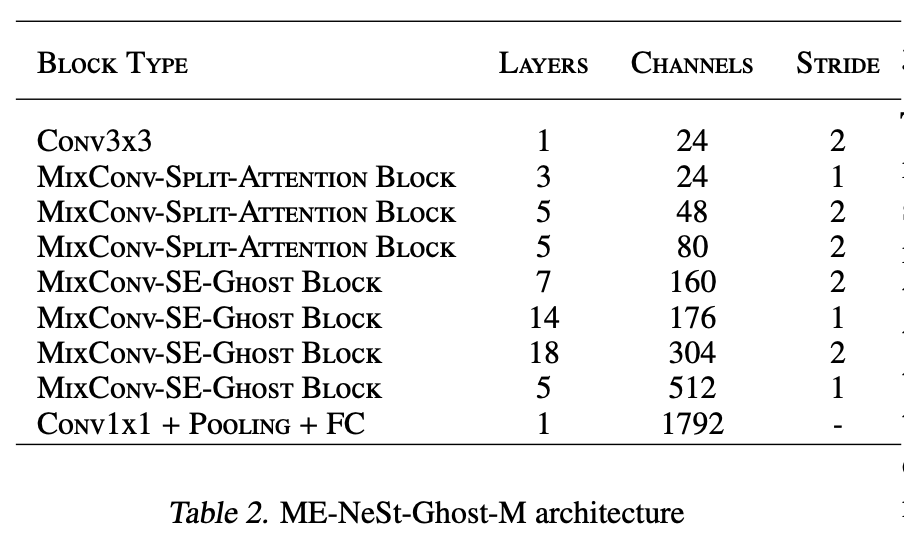
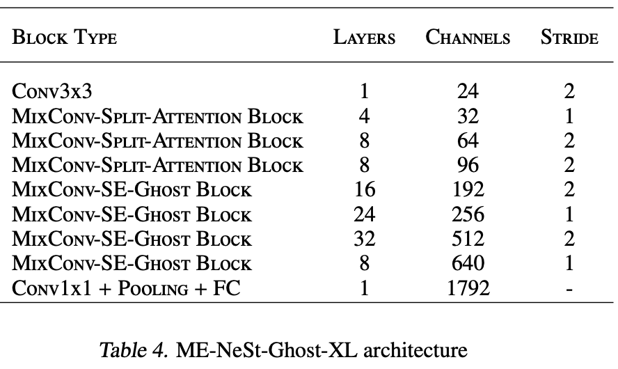
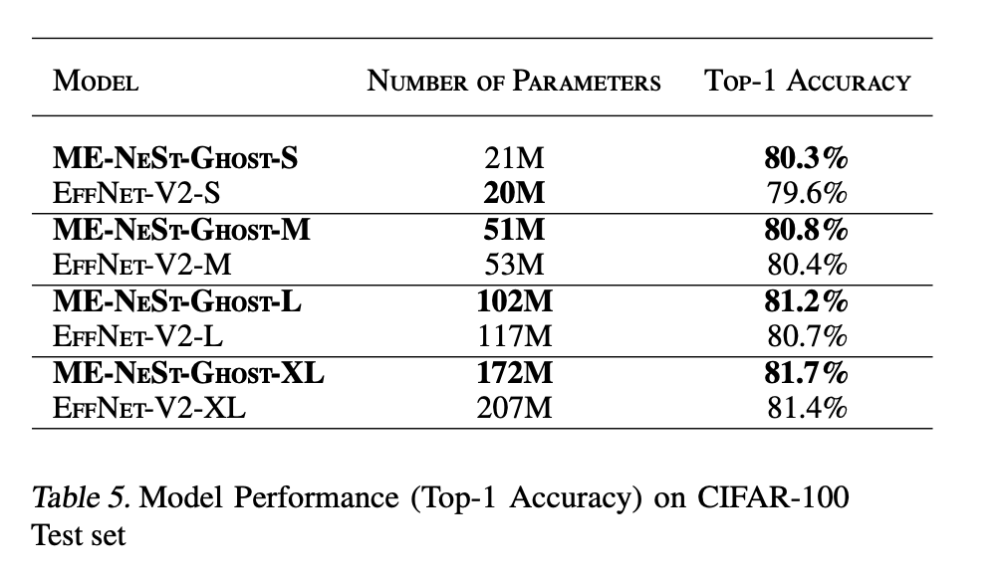

# UoE-Machine-Learning-Practical-INFR11132
This repository contains the code and reports for the course INFR11132 Machine Learning Practical. Overall Mark Achieved - 75%

Coursework 3 features the final project for which the novel model architecture MixConv-EfficientNeSt-Ghost (ME-NeSt-Ghost) was introduced. It was built to improve upon the EfficientNetV2 family of CNNs in image classification tasks with the help of a combination of mixed-depthwise convolutions, split attention modules and ghost convolutions. The ME-NeSt-Ghost was more parameter efficient than the EfficientNetV2 while providing comparable or even better results on the CIFAR-100 dataset

